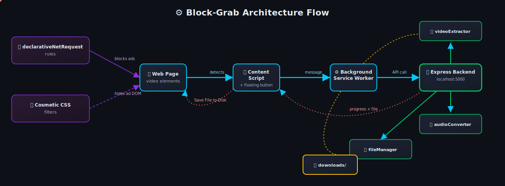

<div align="center">


</div>

## 📖 Overview

<table>
<tr>
<td>

**Block-Grab** is a professional, dual-purpose browser extension built on **Manifest V3**. It bundles two independent utility modules into a single lightweight package:

🛡️ **AdShield Plus** — a high-performance ad blocker that combines Chrome's native `declarativeNetRequest` rule engine with cosmetic DOM filtering to strip out network-level ads *and* visually hide leftover ad containers.

🎬 **HD Video / MP3 Downloader** — a smart content-grabber that detects active `<video>` elements on any page, then coordinates with a dedicated **Node.js + Express** backend to extract streams, convert audio to MP3, or download video up to **4K** quality.

</td>
</tr>
</table>

<br/>

## ✨ Features

<table width="100%">
<tr>
<td width="50%" valign="top">

### 🛡️ AdShield Plus

- ⚡ **Native-speed blocking** via `declarativeNetRequest` rules (no slowdown from JS-based interception)
- 🎯 **Cosmetic filtering** — hides leftover ad containers (`.adsbygoogle` and similar selectors) directly in the DOM
- 🔢 **Live block counter** in the popup, tracking total ads blocked per session
- 🔌 **One-click toggle** to enable/disable protection instantly
- 🌐 Works across ad networks like `doubleclick.net` and other common trackers

</td>
<td width="50%" valign="top">

### 🎬 Video / MP3 Downloader

- 🔍 **Auto-detection** of active video elements on the current page
- 📡 **Backend-powered extraction** through a Node/Express API
- 🎵 **MP3 audio conversion** for audio-only downloads
- 📺 **Up to 4K video** download support with resolution selection
- 🟢 **Floating draggable button** (`📥`) that follows you around the page
- 📊 **Real-time progress bar** for downloading + merging stages
- 💾 Native **Save File to Disk** prompt on completion

</td>
</tr>
</table>

<br/>

## 🏗️ Architecture

<p align="center">
  
</p>

<p align="center"><i>✨ Live data-flow animation — glowing dots travel the connector lines to show requests, messages, and files moving through the system in real time.</i></p>

<details>
<summary><b>📦 Flow Explained</b></summary>
<br/>

1. The **content script** scans the active page for `<video>` elements and injects the floating download button.
2. On click, the **popup / floating UI** sends a message via the **messaging service** to the **background service worker**.
3. The service worker calls the **Node.js + Express backend** (`http://localhost:5000`) with the video/page metadata.
4. The backend's `videoExtractor` service resolves stream URLs, the `audioConverter` handles MP3 conversion if requested, and `fileManager` assembles the final file in `downloads/`.
5. Progress events are streamed back to the extension UI, ending with a **Save File to Disk** prompt.
6. In parallel, **AdShield Plus** runs independently — `declarativeNetRequest` rules block known ad domains at the network layer, while cosmetic CSS filters hide remaining ad containers in the DOM.

</details>

<br/>

## 📂 Repository Structure

```text
├── backend/
│   ├── downloads/               # Directory where finalized downloads are stored
│   ├── temp/                    # Directory for temporary streaming pieces
│   ├── src/
│   │   ├── controllers/         # Express controllers (download.controller.js)
│   │   ├── middleware/          # Error handling (errorHandler.js)
│   │   ├── routes/              # Express Router mappings (download.routes.js)
│   │   ├── services/            # Services (videoExtractor, audioConverter, fileManager)
│   │   └── server.js            # Node/Express application entry
│   ├── .env                     # Server environment settings
│   └── package.json
│
├── extension/
│   ├── src/
│   │   ├── adblock/              # Rules JSON & Cosmetic CSS filters
│   │   ├── assets/                # Icons and images
│   │   ├── background/          # Background worker Service Worker
│   │   ├── content/                # Page scraper and floating button scripts
│   │   ├── popup/                 # Popup page React + HTML
│   │   ├── options/              # Options page React + HTML
│   │   ├── services/              # Storage, messaging, and API services
│   │   └── styles/                 # Global styling variables & typography
│   ├── manifest.json             # MV3 Chrome/Brave Manifest
│   ├── vite.config.js              # Multi-page compiler settings
│   ├── copy-assets.js            # Asset bundling script
│   └── package.json
```

<br/>

## 🧰 Tech Stack

<p align="center">
  
</p>

<div align="center">

| Layer | Technology |
|---|---|
| Extension UI | React, HTML, CSS, Vite (multi-page build) |
| Extension Core | Manifest V3 Service Worker, `declarativeNetRequest` |
| Backend API | Node.js, Express |
| Media Processing | Custom video extraction & audio conversion services |
| Storage | Local `downloads/` & `temp/` directories |

</div>

<br/>

## 🚀 Installation & Setup

> 💡 The project has two independent pieces — the **backend server** and the **browser extension** — both need to be running for full functionality.

### 1️⃣ Backend Server Setup

To configure the Express backend server:

```bash
# Navigate to the backend directory
cd backend

# Install the Node.js dependencies
npm install

# Start the backend in development mode
npm run dev
```

The backend server will launch at **`http://localhost:5000`**.

<br/>

### 2️⃣ Chrome Extension Setup

To compile the Vite/React extension:

```bash
# Navigate to the extension directory
cd extension

# Install the development and runtime packages
npm install

# Generate the required icon assets (runs the base64 builder script)
node generate-icons.js

# Build the extension
npm run build
```

This compiles all React components and packages resources into the static `dist/` directory.

<br/>

### 3️⃣ Load Extension in Browser (Chrome / Brave / Edge)

```text
1. Open your browser and navigate to: chrome://extensions
2. Enable "Developer mode" (toggle in the top-right corner)
3. Click "Load unpacked" in the top-left
4. Select the extension/dist folder from this directory
```

<br/>

## ✅ Verifying & Testing

<table width="100%">
<tr>
<td width="50%" valign="top">

### 🛡️ Testing the Ad Blocker

1. Enable the **AdShield toggle** in the Popup.
2. Visit any web page containing advertisements (ad-heavy sites or standard layout tests work well).
3. Watch as requests matching network block rules (e.g. `doubleclick.net`) get intercepted, and cosmetic selectors (e.g. `.adsbygoogle`) are visually hidden.
4. The popup interface tracks the **total blocked count** live.

</td>
<td width="50%" valign="top">

### 🎬 Testing the Video Downloader

1. Ensure the backend server is running (`npm run dev` inside `backend/`).
2. Play a video on a web page — or open the popup, click **Video Downloader**, then **Load Demo Test Video**.
3. A draggable **📥** button floats in the page's bottom-right corner.
4. Click the floating icon or the popup option, choose your resolution / MP3 format, and hit **Start Download**.
5. Watch the **progress bar** track downloading + merging, ending in a **Save File to Disk** prompt.

</td>
</tr>
</table>

<br/>
<br/>

## 🗺️ Roadmap

- [x] Network-level ad blocking via `declarativeNetRequest`
- [x] Cosmetic DOM filtering for residual ad elements
- [x] Floating draggable download widget
- [x] MP3 audio extraction & conversion
- [x] Up to 4K video download support
- [ ] Firefox / Manifest V2 compatibility layer
- [ ] Cloud-based download history sync
- [ ] Custom user-defined block lists

<br/>

## 🤝 Contributing

Contributions, issues, and feature requests are welcome!

```bash
# Fork the repo, then:
git checkout -b feature/your-feature-name
git commit -m "Add: your feature"
git push origin feature/your-feature-name
# Open a Pull Request 🚀
```

<br/>

## 📜 License

This project is licensed under the **MIT License** — feel free to use, modify, and distribute with attribution.

<br/>

## 👨‍💻 Developer

<div align="center">

<h2>Ashish Goswami</h2>

<a href="mailto:ashishgoswami1013@gmail.com">
  
</a>

<a href="https://www.linkedin.com/in/ashish-goswami-58797a24a">
  
</a>

<a href="https://www.instagram.com/a.s.h.i.s.h__g.o.s.w.a.m.i">
  
</a>

<a href="https://portfolio-omega-sand-67.vercel.app">
  
</a>

</div>

<div align="center">

### ⭐ If you found this project useful, consider giving it a star!


</div>
